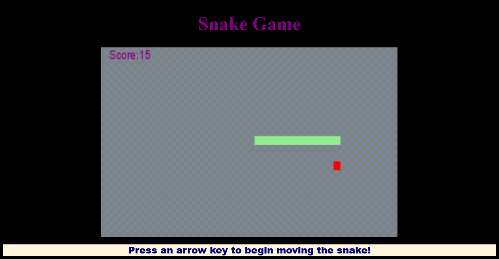

# Snake Game 

The classic snake game made with HTML, CSS, and JavaScript. 

### Play the game by clicking [here](https://iceeeberg.github.io/Snake-Game/)

## Summary

This application introduced me to the concepts on how to use HTML 5 canvas and how JavaScript interacts with it. It helped me better understand arrays and for loops and how to use them with programming. Prior to building this app I would have to say learning arrays and for loops was one of my weaknesses whenever I first started learning to program.  Overall, I had fun building this application as it was exciting getting to build a game while also getting to push myself to overcome one of my weaknesses. 

## Author

Dante Leeseberg - Full Stack Software Developer [LinkedIn](https://www.linkedin.com/in/dante-leeseberg-bba05883/) | [Website](https://www.danteleeseberg.com/)
